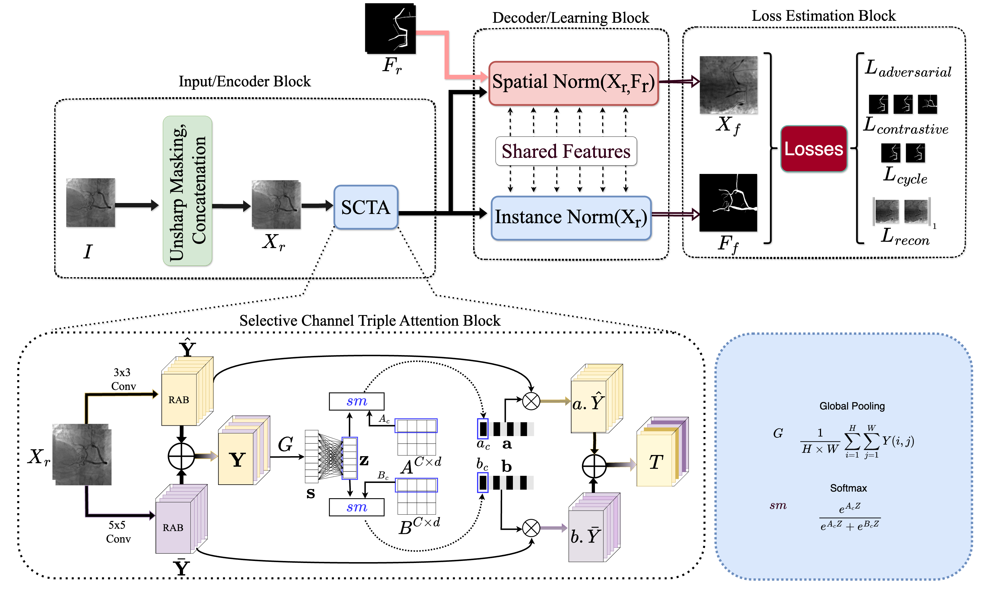
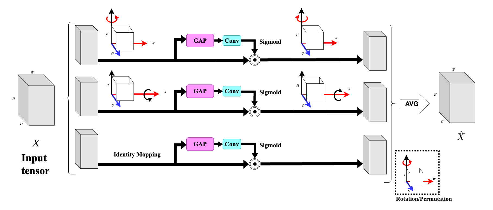

# CoATLAS 🚀

Official repository for "CoATLAS: A generalisable Self-Supervised framework using Triple Attention Mechanism for Robust Vessel Segmentation Across Domains".

## Overview 💡

<div align="center">
  
  <p>CoATLAS Framework Overview</p>
</div>

<div align="center">
  
  <p>Triple Attention Block (TAB)</p>
</div>

## Platform and Environment⚙️

*   **OS**: Ubuntu 🐧
*   **Python**: >= 3.9 🐍
*   **PyTorch**: >= 1.12.1 🔥

## Setup 🛠️

Create a conda environment:

```bash
conda create -n coatlas python=3.9
conda activate coatlas
pip install -r requirements.txt
```

## Data Resources 💾

Datasets used in our experiments:

*   **XCAD**: [[Link](https://www.dropbox.com/scl/fi/mvstwdgxo0hfk678x94d4/XCAD.zip?rlkey=qdztml0gzfzoc0t5d16k71u76&e=1&dl=0)]
*   **DRIVE**: [[Link](https://www.kaggle.com/datasets/andrewmvd/drive-digital-retinal-images-for-vessel-extraction)]
*   **CHASEDB1**: [[Link](https://www.kaggle.com/datasets/khoongweihao/chasedb1)]
*   **30 XCA**: [[Link](https://github.com/Binjie-Qin/SVS-net)]
*   **134 XCA**: [[Link](https://www.mdpi.com/2076-3417/9/24/5507)]

## Training 🚀

```bash
python3 main.py -p train -c config/train.json
```

## Testing 🧪

```bash
python3 main.py -p test -c config/test.json
```

## Pre-trained Models 🧠

Pre-trained models for evaluation will be available soon!


## 🤝Citation
<!-- ```
 @article{your_citation,
  title={CoATLAS: A generalisable Self-Supervised framework using Triple Attention Mechanism for Robust Vessel Segmentation Across Domains},
  author={Author, A. and Author, B.},
  journal={Journal Name},
  year={2024}
} 
``` -->

## Thankful
We acknowledge the use of code from:

*   **NVIDIA SPADE**: [[GitHub](https://github.com/NVlabs/SPADE)]
*   **SSVS (SJTU Shanghai)**: [[GitHub](https://github.com/AISIGSJTU/SSVS)]
*   **C-DARL (Boah Kim)**: [[GitHub](https://github.com/boahK/MEDIA_CDARL/tree/main)]

We appreciate their contributions to open source.